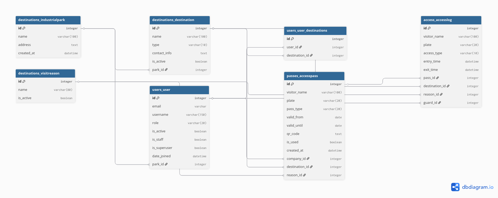

# GateFlow — Arquitectura del Backend

Sistema de gestión de accesos para parques industriales. Empresas generan pases QR; guardias los validan en la entrada; admins monitorean métricas.

**Stack:** Python 3.13 · Django 6 · PostgreSQL (prod) / SQLite3 (dev) · DRF + SimpleJWT · uv

---

## Roles del sistema

| Rol | Creado por | Responsabilidad |
|---|---|---|
| `is_superuser` | Django shell / createsuperuser | Crea parques industriales y primeros admins vía Django Admin |
| `admin` | superuser | Gestiona su parque: users, destinations, visit_reasons |
| `guard` | admin | Registra entradas/salidas, valida QR en la puerta |
| `company` | admin | Genera pases QR para sus destinos asignados |

---

## Estructura de apps

Cuatro apps por dominio — el rol define permisos, no estructura de datos.

| App | Modelos | Responsabilidad |
|---|---|---|
| `users` | `User` | Autenticación, roles, JWT |
| `destinations` | `IndustrialPark`, `Destination`, `VisitReason` | Catálogos del parque |
| `passes` | `AccessPass` | Generación de pases QR |
| `access` | `AccessLog` | Registro de entradas/salidas y métricas |

---

## Flujo principal

```
Admin crea Destination en su parque
         ↓
Admin crea User(company) y asigna Destination[]  ←── M2M
         ↓
Company elige uno de sus Destination y genera AccessPass
         ↓
AccessPass.destination_id = Destination específico (FK)
         ↓
Guard escanea QR → valida AccessPass → crea AccessLog
```

**Punto clave:** `AccessPass` tiene FK directa a `Destination`, no al `User`. El M2M `User.destinations` solo define qué destinos puede usar la empresa al generar un pase.

---

## Decisiones técnicas

### `User` — diseño del modelo

- `USERNAME_FIELD = "email"` — login por email, username se autogenera
- `email` con `unique=True` (Django no lo hace por defecto en `AbstractUser`)
- FK a `IndustrialPark` con string lazy `"destinations.IndustrialPark"` para evitar imports circulares
- `UserManager` propio elimina la dependencia de `username` en `create_superuser`
- `CustomUserAdmin` redefine `fieldsets` completo (no concatena con `UserAdmin.fieldsets`) porque mypy no puede garantizar que no sea `None`

### Estructura de repositorios

- Dos repos separados: `gateflow-backend` y `gateflow-frontend`
- Frontend: un solo proyecto con separación en `/pages/admin`, `/pages/guard`, `/pages/company`

### Migraciones

- `AUTH_USER_MODEL` debe declararse **antes** de la primera migración. Si no, las migraciones de `admin` apuntan al modelo equivocado y la base queda inconsistente.

### mypy

- `django_settings_module` va en `[mypy.plugins.django-stubs]`, no en `[mypy]`
- `explicit_package_bases = true` en `mypy.ini` resuelve el conflicto "source file found twice"

---

## Endpoints — resumen por rol

| Tag | Método | Ruta | Roles |
|---|---|---|---|
| Auth | POST | `/auth/login/` | todos |
| Auth | POST | `/auth/refresh/` | todos |
| Auth | POST | `/auth/logout/` | todos |
| Auth | POST | `/auth/change-password/` | todos |
| Users | GET/POST | `/users/` | admin |
| Users | GET/PATCH | `/users/{id}/` | admin |
| Destinations | GET/POST | `/destinations/` | admin (W), otros (R) |
| Destinations | GET/PATCH | `/destinations/{id}/` | admin (W), otros (R) |
| VisitReasons | GET/POST | `/visit-reasons/` | admin (W), otros (R) |
| VisitReasons | PATCH | `/visit-reasons/{id}/` | admin |
| Passes | GET/POST | `/passes/` | company (W), admin (R) |
| Passes | GET | `/passes/{id}/` | company (propio), admin |
| Passes | POST | `/passes/validate/` | guard |
| AccessLogs | GET/POST | `/access-logs/` | guard (W), admin (R) |
| AccessLogs | POST | `/access-logs/{id}/exit/` | guard |
| Metrics | GET | `/metrics/summary/` | admin |
| Metrics | GET | `/metrics/by-day/` | admin |
| Metrics | GET | `/metrics/by-hour/` | admin |
| Metrics | GET | `/metrics/top-destinations/` | admin |

---

## Diagrama de base de datos (DBML)



### Relaciones clave

```
IndustrialPark (1) ──< Destination (M)
IndustrialPark (1) ──< User (M)
User (M) >──< Destination (M)  [via users_user_destinations]
User(company) (1) ──< AccessPass (M)
Destination (1) ──< AccessPass (M)   ← FK directa, no a User
VisitReason (1) ──< AccessPass (M)
AccessPass (1) ──< AccessLog (M)     ← null si entrada manual
Destination (1) ──< AccessLog (M)    ← desnormalizado
User(guard) (1) ──< AccessLog (M)
```

---

## Estado actual de implementación

| Modelo | Estado |
|---|---|
| `IndustrialPark` | Implementado |
| `User` | Implementado (⚠️ campo `destinations` M2M pendiente de migrar — requiere crear `Destination` primero) |
| `Destination` | Pendiente |
| `VisitReason` | Pendiente |
| `AccessPass` | Pendiente |
| `AccessLog` | Pendiente |

| Endpoint | Estado |
|---|---|
| `POST /auth/login/` | Implementado |
| `POST /auth/refresh/` | Implementado |
| `POST /auth/logout/` | Implementado |
| `GET /auth/me/` | Implementado |
| `POST /auth/change-password/` | Implementado |
| `GET/POST /users/` | Pendiente |
| Resto | Pendiente |
